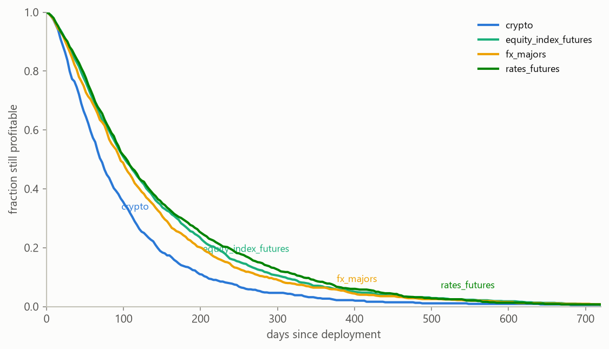
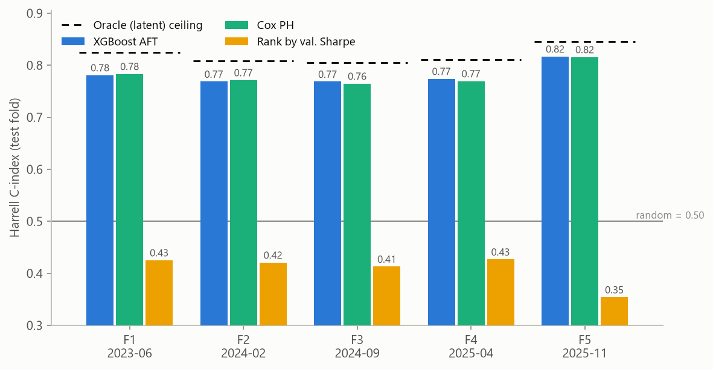
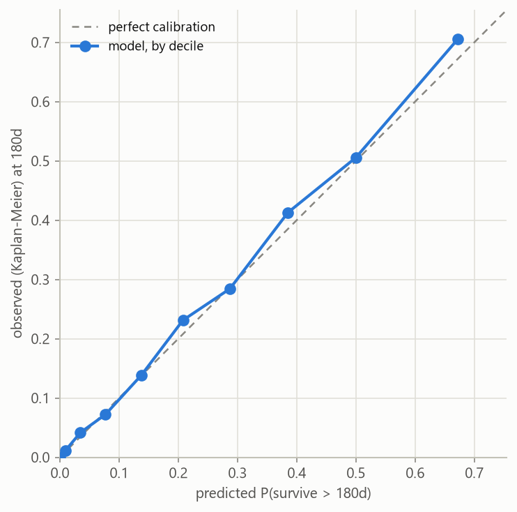
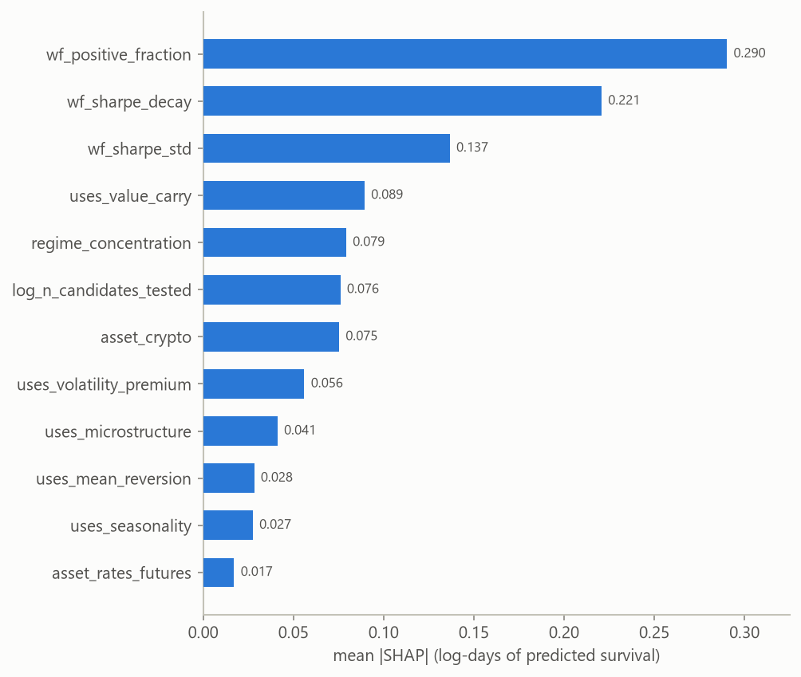

# Strategy survival meta-model

I run an automated search system that discovers trading strategies and
validates them walk-forward. The strategies decay: an edge that clears
validation today is usually unprofitable within months, and the decay rate
varies enormously. This project builds the meta-model I want on top of such a
system, one that predicts how long a newly discovered strategy will stay
profitable out-of-sample, using nothing but the metadata available on the day
it is deployed.

Everything in this repo runs on synthetic data. The generator reproduces the
statistical structure of a real strategy-search pipeline (selection bias,
walk-forward statistics, regime exposures, censored lifetimes) without
containing anything proprietary. That trade has a benefit beyond
confidentiality: because I wrote the generative process, I can score the model
against the true latent signal and check whether SHAP recovers the mechanisms
I built in.

## Why survival analysis

The naive framing is regression on lifetime, but a live research book breaks
it: strategies deployed recently have not died yet. In this dataset, 7% of
all strategies are censored (still running at the observation cutoff or
administratively retired), and in the most recent evaluation fold that figure
is 39%. Dropping those rows discards
exactly the strategies that survived longest; imputing "still alive" as a
death date biases the other way. Right-censoring is the standard machinery for
this, so the model is an accelerated-failure-time model: XGBoost with the
`survival:aft` objective, where a death is the interval [t, t] and a censored
strategy is [t, infinity).

Classification ("will it survive 90 days?") throws away resolution and forces
one horizon. The AFT model predicts a full time distribution, which collapses
to any horizon on demand.

## The data

`strategy_survival/generate.py` draws candidate strategies with two latent
components, true edge and overfit, then keeps only candidates whose validation
Sharpe clears a threshold, mimicking how strategies actually enter a
deployment queue. Validation Sharpe conflates the two latents; walk-forward
consistency statistics, trade counts, and search intensity are noisy proxies
that partially separate them. Survival time is log-normal in the latents plus
observable effects for feature family (momentum decays, carry persists),
asset class, regime concentration, and the size of the search that produced
the candidate. Lifetimes are censored by the observation cutoff and by a
small rate of administrative retirement.



Median observed lifetime is 91 days. Crypto strategies decay visibly faster,
by construction, and the model has to recover that from 15% of the rows.

## Method

The evaluation is five expanding-window temporal folds over discovery dates.
The detail I care most about: training labels are re-censored at each fold's
split date, because a strategy that died after the split was still alive as
far as any model trained at that date could know. Evaluating without this step
looks fine and leaks the future. Hyperparameters are chosen on the first
fold's training window by held-out censored log-likelihood, and the predictive
log-normal scale is calibrated on a temporal tail slice the early-stopping
probe never saw. Likelihood, not C-index, drives selection; a ranking metric
is blind to a broken probability scale, and an earlier version of this
pipeline had exactly that failure (calibrated fine on ranking, worse than a
no-skill forecast on 365-day Brier).

Baselines: a Cox proportional-hazards model on the same features, and the
heuristic every backtest-driven allocator implicitly uses, ranking strategies
by their validation Sharpe.

## Results

Pooled over 3,000 out-of-fold test strategies (seed 7; full detail in
[reports/evaluation.md](reports/evaluation.md) and `reports/metrics.json`):

| Model | Harrell C-index |
|---|---|
| XGBoost AFT | 0.782 [0.773, 0.790] |
| Cox PH (fold mean) | 0.781 |
| Rank by validation Sharpe | 0.410 [0.397, 0.422] |
| Oracle on latent log-time | 0.820 |

The Cox row is a mean of per-fold C-indexes rather than pooled: Cox risk
scores are relative within each fold's fit, so they do not concatenate across
folds the way predicted survival times do.



The headline is not the 0.78. It is the 0.41: ranking by validation Sharpe is
worse than random, because selection on that same Sharpe guarantees the
survivors' scores are inflated by overfitting. A meta-model looking at
consistency proxies beats the backtest metric it was selected on. That is the
phenomenon that makes this problem worth modeling, and the synthetic generator
reproduces it because I have watched it happen in production.

Two honest notes on that table. The boosted model ties the Cox baseline; the
metadata's signal is close to additive, and I report the tie instead of
tuning until the tree model wins. And the oracle score of 0.820, the C-index
of the true latent predictor that generated the lifetimes, shows both models
are about 0.04 from the noise ceiling. The remaining gap is mostly
irreducible measurement noise, not model capacity.

Probability calibration at 180 days tracks the diagonal decile by decile, and
IPCW Brier scores beat the no-skill marginal at every horizon (0.148 vs 0.249
at 90 days):



## What the model looks at



Walk-forward consistency dominates: the fraction of profitable folds, the
Sharpe decay slope across folds, and fold-to-fold Sharpe dispersion carry more
attribution than everything else combined. Validation Sharpe itself does not
make the top twelve, which is the winner's curse seen from inside the model.
The full reading, including where SHAP's story matches the generator's ground
truth and where the attribution split is arbitrary, is in
[reports/shap_interpretation.md](reports/shap_interpretation.md).

## Limitations

The model is only as honest as the generator, and the generator is my prior
about how strategy decay works, not evidence. Real metadata has correlated
lifetimes (strategies die together in regime breaks), drift in the search
system itself, and no oracle to measure the ceiling against. The bootstrap
intervals resample strategies independently and therefore understate
uncertainty. Administrative retirement is treated as independent censoring;
in production, retirement usually correlates with early signs of decay, which
would bias survival estimates upward. All results are from a single generator
seed. I would treat the C-index here as an upper bound on what production
data would give, and the methodology (temporal folds, label re-censoring,
likelihood-based selection, held-out scale calibration) as the part that
transfers.

## Running it

Python 3.11+. From the repo root:

```
python -m venv .venv
.venv\Scripts\python -m pip install -e ".[dev]"
.venv\Scripts\python -m pytest
.venv\Scripts\python -m strategy_survival run
```

The `run` command regenerates the data, runs the temporal CV, and writes
`reports/metrics.json` plus all figures in about two minutes on a laptop.
The markdown reports are authored against the seeded default run, not
generated.

## Layout

```
src/strategy_survival/
  generate.py       synthetic metadata + censored survival target
  features.py       feature matrix with a fixed column contract
  cv.py             expanding-window folds and label re-censoring
  model.py          XGBoost AFT wrapper + predictive-scale calibration
  baseline.py       Cox PH and the validation-Sharpe heuristic
  evaluate.py       Harrell C, IPCW Brier, decile calibration, bootstrap
  plots.py          report figures
  shap_analysis.py  attributions on the log-time margin
  pipeline.py       the whole run, end to end
tests/              41 tests covering generator invariants, leakage, metrics
reports/            authored analysis + generated metrics and figures
```
